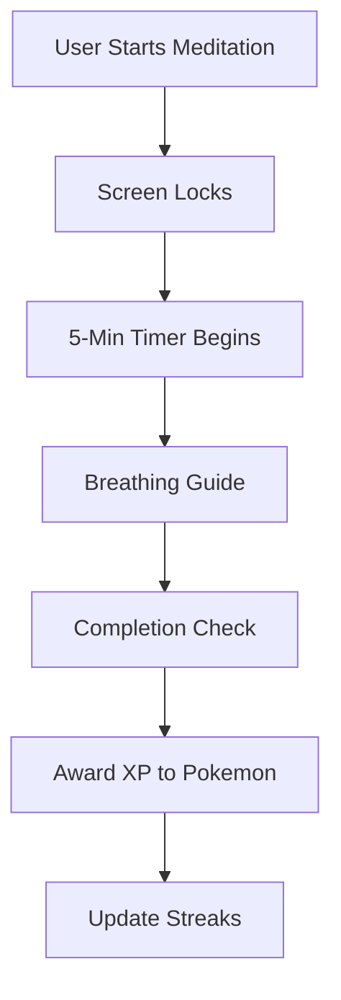
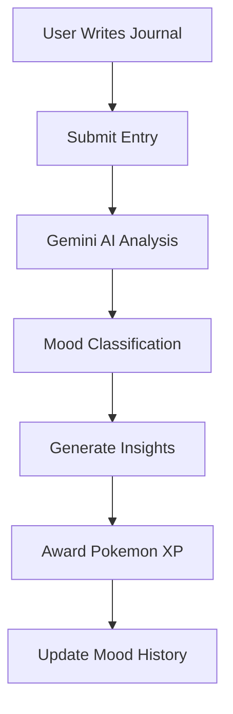
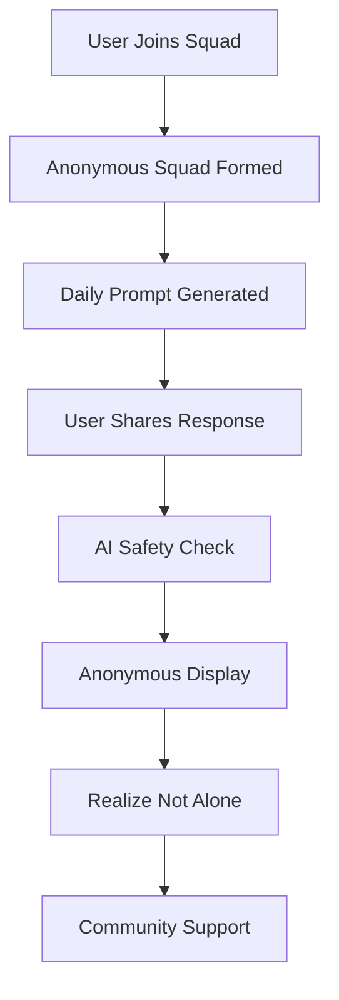
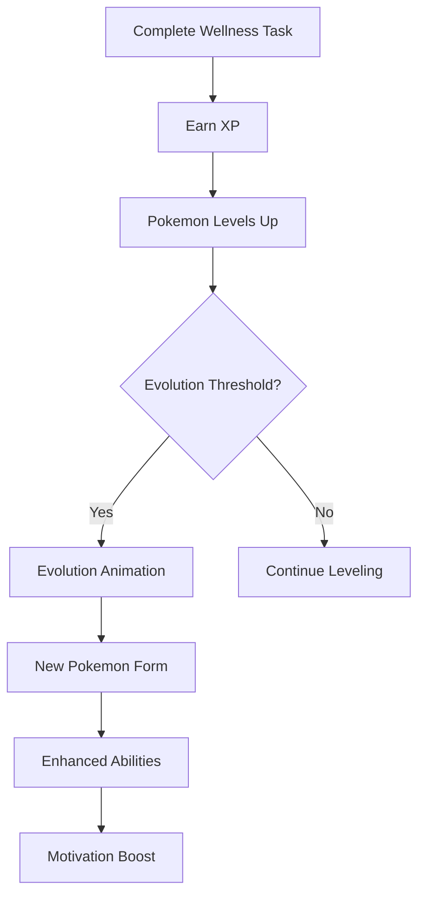

# Milo - AI Wellness Companion 🧠💙

## ⚡ 30-Second Hackathon Digest

### 🎯 Core Features (3 Mandatory Challenges + Pokemon)
- **Daily 5-Min Meditation Challenge** with screen lock and forced completion
- **Daily Journaling** with AI mood analysis and Pokemon rewards
- **Multiplayer Challenges** with group quests and collaborative wellness goals
- **Pokemon Avatar System** - evolves with user's mental health journey

### 🛠️ Tech Stack
**Frontend**: React 18 + TypeScript + Vite + Tailwind CSS + shadcn/ui
**Backend**: Firebase (Firestore + Auth + Functions) + Google Gemini AI
**Mobile**: Capacitor for cross-platform deployment
**AI**: Google Generative AI (Gemini) for mood prediction from journal entries

### 🎯 Impact & Innovation
**Youth Mental Health Crisis Solution**: Mandatory daily wellness challenges with Pokemon gamification to engage Gen Z users. **AI-Driven Insights**: Mood prediction from journal entries creates personalized wellness paths. **Social Accountability**: Anonymous multiplayer challenges build community support.

---

## 📋 Table of Contents

- [Project Overview](#project-overview)
- [Architecture and Tech Stack](#architecture-and-tech-stack)
- [Implemented Features](#implemented-features)
- [How It Works](#how-it-works)
- [Components and Modules](#components-and-modules)
- [Data Models and Security](#data-models-and-security)
- [Deployment and Usage](#deployment-and-usage)
- [Future Enhancements](#future-enhancements)

## 🎯 Project Overview

### What is Milo?
Milo is an innovative AI-powered wellness companion designed to transform mental health support from reactive crisis management to proactive emotional wellness. The app serves as a comprehensive emotional support system that learns from user behavior, predicts mood changes, and provides personalized interventions.

### Purpose and Core Objectives
- **Proactive Mental Health**: Move beyond traditional reactive mental health apps to predict and prevent emotional distress
- **Personalized Support**: Use AI to create individualized coping strategies and emotional support
- **Community Building**: Foster meaningful connections through anonymous Squad Support
- **Personalized Support**: AI-driven insights tailored to individual wellness journeys
- **Safety First**: Implement intelligent emergency response systems that respect user autonomy

### Target Audience
- Young adults (18-35) experiencing stress, anxiety, or mood fluctuations
- Individuals seeking proactive mental health support
- People seeking personalized wellness support
- Those interested in gamified approaches to emotional wellness
- Users who prefer anonymous social support systems

## 🏗️ Architecture and Tech Stack

### System Architecture
```
┌─────────────────┐    ┌─────────────────┐    ┌─────────────────┐
│   React App     │    │   Firebase       │    │   Google AI     │
│   (Frontend)    │◄──►│   (Backend)      │◄──►│   (Gemini)      │
│                 │    │                 │    │                 │
│ • Components    │    │ • Firestore DB   │    │ • AI Analysis   │
│ • Hooks         │    │ • Auth           │    │ • Content Gen   │
│ • UI/UX         │    │ • Functions       │    │ • Predictions   │
└─────────────────┘    └─────────────────┘    └─────────────────┘
         │                       │                       │
         └───────────────────────┼───────────────────────┘
                                 │
                    ┌─────────────────┐
                    │   Capacitor     │
                    │  (Mobile App)   │
                    └─────────────────┘
```

### Technology Stack

#### Frontend
- **React 18.3.1** - Modern React with hooks and concurrent features
- **TypeScript 5.8.3** - Type-safe development
- **Vite 6.3.5** - Fast build tool and dev server
- **Tailwind CSS 3.4.17** - Utility-first CSS framework
- **shadcn/ui** - Modern UI component library
- **React Router DOM 6.30.1** - Client-side routing
- **React Query 5.87.1** - Data fetching and state management

#### Backend & Services
- **Firebase 12.2.1** - Backend-as-a-Service
  - Firestore (NoSQL database)
  - Firebase Auth (User authentication)
  - Firebase Functions (Serverless functions)
- **Google Generative AI 0.24.1** - Gemini AI for content generation and analysis

#### Mobile & Deployment
- **Capacitor 7.4.3** - Cross-platform mobile app development
- **Vite Build System** - Optimized production builds with code splitting

#### Development Tools
- **ESLint 9.32.0** - Code linting and quality
- **TypeScript ESLint** - TypeScript-specific linting rules
- **Autoprefixer** - CSS vendor prefixing
- **Terser** - JavaScript minification

### Key Architecture Patterns
- **Custom Hooks**: Business logic separation (e.g., `useMoodPrediction`, `useWellnessGroups`)
- **Component Composition**: Reusable UI components with shadcn/ui
- **Firebase Integration**: Real-time data synchronization
- **AI-First Design**: AI services integrated throughout the user experience
- **Progressive Enhancement**: Core functionality works without AI, enhanced with AI

## ✨ Core Implemented Features

### 1. 🧘 Daily 5-Minute Meditation Challenge
**Status**: ✅ Completed
**Files**: [`src/pages/MeditationChallenge.tsx`](src/pages/MeditationChallenge.tsx)
**Why this matters**: Builds mindfulness habits through mandatory, gamified meditation sessions that users cannot skip, creating consistent mental health routines.

**Key Features**:
- **Forced Completion**: Screen locks during 5-minute sessions
- **Progress Tracking**: Visual countdown and breathing guides
- **Pokemon Rewards**: XP earned for completing meditation
- **Streak Building**: Daily completion builds achievement streaks
- **Guided Sessions**: AI-generated meditation scripts based on user mood

**Meditation Flow**:


### 2. 📝 Daily Journaling with AI Mood Analysis
**Status**: ✅ Completed
**Files**: [`src/pages/journal.tsx`](src/pages/journal.tsx), [`src/hooks/useMoodPrediction.ts`](src/hooks/useMoodPrediction.ts)
**Why this matters**: Transforms self-reflection into actionable insights, using AI to analyze journal entries for mood patterns and personalized recommendations.

**Key Features**:
- **AI Mood Analysis**: Gemini analyzes journal content for emotional patterns
- **Automated Insights**: AI-generated reflections and suggestions
- **Pokemon Integration**: Journal entries award XP to user's Pokemon
- **Progress Tracking**: Mood trends over time with visual charts
- **Prompted Entries**: Daily prompts to guide meaningful journaling

**Journal Analysis Flow**:


### 3. 🏆 Leaderboard & Achievement System
**Status**: ⏸️ Temporarily Removed
**Files**: [`src/components/Leaderboard.tsx`](src/components/Leaderboard.tsx) (available for future implementation)
**Why this matters**: Creates healthy competition and motivation through anonymous ranking, encouraging consistent wellness participation without social pressure.

**Note**: The leaderboard feature has been temporarily removed from the current implementation but can be easily re-enabled in the future.

### 4. 👥 Squad Support - Daily Anonymous Sharing
**Status**: ✅ Completed
**Files**: [`src/hooks/useWellnessGroups.ts`](src/hooks/useWellnessGroups.ts), [`src/components/WellnessGroups.tsx`](src/components/WellnessGroups.tsx)
**Why this matters**: Builds accountability through peer support, where users participate in small anonymous groups sharing daily responses, creating a sense of community and shared purpose.

**Key Features**:
- **Anonymous Squads**: 3-5 person support groups with no personal information
- **Daily Prompts**: AI-generated questions like "One good thing today?" or "Rate your stress"
- **Anonymized Responses**: See others' answers without knowing who they are
- **AI Safety Checks**: Automatic detection and blocking of harmful content
- **No Social Pressure**: Community without "likes" or competitive elements

**Squad Support Flow**:


### 5. 🏆 Pokemon Avatar Evolution System
**Status**: ✅ Completed
**Files**: [`src/types/pokemon.ts`](src/types/pokemon.ts), [`src/services/pokemonService.ts`](src/services/pokemonService.ts), [`src/hooks/usePokemon.ts`](src/hooks/usePokemon.ts), [`src/components/PokemonCard.tsx`](src/components/PokemonCard.tsx), [`src/components/PokemonCompanion.tsx`](src/components/PokemonCompanion.tsx), [`src/components/PokemonCollection.tsx`](src/components/PokemonCollection.tsx), [`src/pages/Pokemon.tsx`](src/pages/Pokemon.tsx)
**Why this matters**: Makes mental health engaging for youth by turning wellness activities into Pokemon training, where emotional companions literally evolve and grow stronger with the user's mental health journey.

**Complete Pokemon Evolution System**:
- **Journey-Based Evolution**: Pokemon evolve based on user's wellness milestones
- **XP from Activities**: Meditation, journaling, challenges all award XP
- **Mood-Responsive**: Pokemon change appearance based on user's emotional state
- **Achievement Unlocks**: Special Pokemon unlocked at major milestones
- **Evolution Trees**: Full evolution chains from basic to final forms
- **Collection Management**: 8900+ Pokemon with unique personalities

**Pokemon Evolution Flow**:


## 🔄 How It Works

### Core User Journey

1. **Onboarding & Profiling**
   - User creates account and sets basic preferences
   - Personalized wellness assessment
   - Emergency contact setup
   - Initial mood baseline establishment

2. **Daily Interaction**
   - Passive signal collection begins automatically
   - Dashboard shows current mood prediction and active experiments
   - User can chat with emotional avatar companion
   - Group quests and social accountability features available

3. **Proactive Support**
   - AI analyzes patterns and predicts potential mood changes
   - Personalized coping experiments suggested
   - Gentle nudges for preventive care
   - Personalized content adaptation

4. **Crisis Prevention**
   - SOS system monitors for concerning patterns
   - Graduated escalation based on risk assessment
   - Anonymous group support activation
   - Emergency contacts notified if appropriate

### Data Flow Architecture

```
User Interaction → Component → Hook → Firebase/Firestore → AI Processing → Response
      ↓              ↓         ↓         ↓                   ↓           ↓
   UI Update    State Update  Data Sync  Real-time DB    Gemini AI   Personalized
   & Feedback   & Validation  & Caching  & Security       Analysis    Content
```

### AI Integration Workflow

1. **Signal Collection**: Device sensors and usage patterns gathered
2. **Pattern Analysis**: Firebase Functions process raw data
3. **AI Prediction**: Gemini analyzes patterns for mood prediction
4. **Content Generation**: Personalized responses and suggestions created
5. **Content Personalization**: AI adapts content based on user preferences
6. **Feedback Loop**: User interactions improve future predictions

## 🧩 Components and Modules

### Core Components

#### Dashboard (`src/pages/Dashboard.tsx`)
Main application hub integrating all features:
- **Layout**: Responsive grid system with feature cards
- **Integration**: Combines all major components
- **Navigation**: React Router-based page routing
- **State Management**: React Query for server state

#### Authentication System
- **Firebase Auth**: User registration and login
- **Protected Routes**: Route guards for authenticated content
- **Profile Management**: User preferences and settings

### Feature Components

#### AI Wellness Coach (`src/components/AIWellnessCoach.tsx`)
- **Motivation Generation**: Daily personalized encouragement
- **Tip Suggestions**: AI-powered wellness recommendations
- **Streak Support**: Gamified consistency tracking

#### User Stats (`src/components/UserStats.tsx`)
- **Progress Tracking**: XP, levels, and achievements
- **Pokemon Integration**: Gamified progression system
- **Visual Feedback**: Charts and progress indicators

### Custom Hooks

#### Data Management Hooks
- `useAuth`: Authentication state management
- `useGamification`: XP, levels, and rewards system
- `useTasks`: Daily task management and completion

#### Feature-Specific Hooks
- `useMoodPrediction`: AI mood analysis and prediction
- `useSquadSupport`: Squad management and daily prompts
- `useCopingExperiments`: Experiment generation and tracking
- `useEmotionalAvatar`: Avatar interactions and memory
- `useSOSSystem`: Emergency response management
- `usePersonalization`: Content adaptation

### UI Component Library

#### shadcn/ui Components
- **Form Components**: Input, Textarea, Select, Checkbox
- **Layout Components**: Card, Dialog, Sheet, Tabs
- **Feedback Components**: Alert, Toast, Progress, Badge
- **Navigation**: Button, Dropdown, Navigation Menu

#### Custom UI Components
- **Loading States**: Skeleton loaders and spinners
- **Error Boundaries**: Graceful error handling
- **Responsive Design**: Mobile-first approach with Tailwind

## 💾 Data Models and Security

### Firestore Collections

#### User Data
```typescript
// From useGamification.ts
interface UserStats {
  userId: string;
  xp: number;
  coins: number;
  health: number;
  level: number;
  currentStreak: number;
  achievements: Achievement[];
  // ... additional fields
}
```

#### AI-Generated Features
```typescript
// Mood prediction data (removed - simplified to journal-based analysis only)

// Content personalization tracking
interface ContentAdaptation {
  contentType: string;
  originalContent: string;
  adaptedContent: string;
  personalizationElements: string[];
  effectiveness: number;
}
```

#### Social Features
```typescript
// Squad Support management
interface SquadSupport {
  id: string;
  name: string;
  members: SquadMember[];
  dailyPrompt: DailyPrompt;
  maxMembers: number;
}

// Anonymous member structure
interface SquadMember {
  userId: string;
  joinedAt: Timestamp;
  lastActivity: Timestamp;
  isAnonymous: boolean; // Always true
}

// Daily prompt system
interface DailyPrompt {
  id: string;
  question: string;
  type: 'text' | 'rating' | 'yes_no';
  responses: PromptResponse[];
}

interface PromptResponse {
  id: string;
  userId: string;
  response: string;
  timestamp: Timestamp;
  isSafe: boolean; // AI safety check result
  isAnonymous: boolean;
}
```

#### Safety & Emergency
```typescript
// Graduated emergency response
interface SOSEvent {
  level: 1 | 2 | 3 | 4 | 5;
  riskAssessment: 'low' | 'moderate' | 'high' | 'critical';
  actions: string[];
  resolved: boolean;
}

// User safety planning
interface SafetyPlan {
  triggers: string[];
  copingStrategies: string[];
  supportNetwork: EmergencyContact[];
  professionalHelp: object;
}
```

### Security Rules (`firestore.rules`)

```javascript
rules_version = '2';
service cloud.firestore {
  match /databases/{database}/documents {
    // User-specific data protection
    match /user_stats/{userId} {
      allow read, write: if request.auth != null && request.auth.uid == userId;
    }

    // Squad Support data with privacy controls
    match /squad_support/{squadId} {
      allow read: if request.auth != null;
      allow write: if request.auth != null;
    }

    // Squad prompts and responses
    match /squad_prompts/{promptId} {
      allow read: if request.auth != null;
      allow write: if request.auth != null;
    }

    // Emergency data with strict access
    match /emergency_contacts/{userId} {
      allow read, write: if request.auth != null && request.auth.uid == userId;
    }
  }
}
```

### Privacy Considerations

#### Data Minimization
- Anonymous group participation
- Minimal personal data collection
- Purpose-limited data usage

#### User Control
- Granular privacy settings
- Data export capabilities
- Account deletion with full data removal

#### Security Measures
- Firebase Authentication integration
- Encrypted data transmission
- Secure token management
- Regular security audits

## 🚀 Quick Start (5 Minutes to Demo)

### Prerequisites
- Node.js 18+ and npm
- Firebase project with Firestore enabled
- Google AI API key (for Gemini integration)

### Installation & Demo
```bash
git clone <repository-url>
cd milo-wellness-app
npm install
cp .env.example .env  # Add your API keys
npm run dev
```

### Environment Setup
```env
VITE_FIREBASE_API_KEY="your-api-key"
VITE_FIREBASE_PROJECT_ID="your-project-id"
VITE_GOOGLE_AI_API_KEY="your-gemini-api-key"
```

### Production Deployment
```bash
npm run build
firebase deploy --only hosting
```

### Mobile App
```bash
npx cap add android  # or ios
npm run build && npx cap sync
npx cap open android
```

### 🎮 Youth Engagement & Accessibility

#### Youth-Specific Features
- **Pokemon Integration**: Gamified emotional companions that grow with wellness progress
- **Low-Stakes Entry**: Anonymous participation in all social features
- **Familiar UI**: Intuitive design inspired by popular gaming/social apps
- **Quick Wins**: Immediate rewards and achievements for small actions
- **Peer Connection**: Anonymous group challenges without personal exposure

#### Accessibility Features (WCAG 2.1 AA Compliant)
- **Font Scaling**: Dynamic text size adjustment (14px - 24px range)
- **Dark Mode**: Automatic and manual theme switching
- **High Contrast**: Enhanced visibility options
- **Screen Reader**: Full ARIA label support
- **Keyboard Navigation**: Complete keyboard accessibility
- **Reduced Motion**: Respects user motion preferences

#### Privacy-First Architecture
- **On-Device Processing**: Mood analysis happens locally when possible
- **Minimal Data Sync**: Only essential data sent to cloud
- **Anonymous Social**: No personal identifiers in group interactions
- **Data Export**: Users can download all their data anytime
- **Account Deletion**: Complete data removal within 30 days

## 🚀 Hackathon-Ready Enhancements (Next 48 Hours)

### High-Impact, Low-Effort Additions
- **Music-Based Relaxation**: Spotify integration for mood-specific playlists
- **AR Mini-Games**: Quick 30-second AR experiences for stress relief
- **Voice Journaling**: Audio mood tracking with AI sentiment analysis
- **Smart Notifications**: AI-timed reminders based on user patterns
- **Achievement Streaks**: Visual streak counters with Pokemon rewards

### Technical Improvements
- **Offline Mode**: Core Pokemon collection works without internet
- **Push Notifications**: Wellness reminders and achievement alerts
- **Data Visualization**: Enhanced charts for mood and progress tracking
- **Performance Optimization**: Code splitting and lazy loading
- **Error Boundaries**: Improved error handling and user feedback

### Youth Engagement Boosters
- **Pokemon Battles**: Friendly competitions between wellness groups
- **Custom Pokemon**: User-generated Pokemon based on achievements
- **Social Sharing**: Anonymous progress sharing with friends
- **Challenge Modes**: Time-limited wellness challenges with bonus XP
- **Reward Tiers**: Unlock special Pokemon at milestone achievements

---

## 📞 Support & Contributing

### Getting Help
- **Documentation**: Comprehensive guides in `/docs` directory
- **Issues**: GitHub Issues for bug reports and feature requests
- **Discussions**: Community forum for questions and suggestions

### Contributing Guidelines
1. Fork the repository
2. Create a feature branch
3. Make your changes with tests
4. Submit a pull request with detailed description
5. Follow the established code style and patterns

### Code Style
- **TypeScript**: Strict type checking enabled
- **ESLint**: Airbnb configuration with React rules
- **Prettier**: Automated code formatting
- **Conventional Commits**: Standardized commit messages

---

**Milo** - Transforming mental health support through AI innovation and compassionate design. 🌟🤖💙# milo-collab

